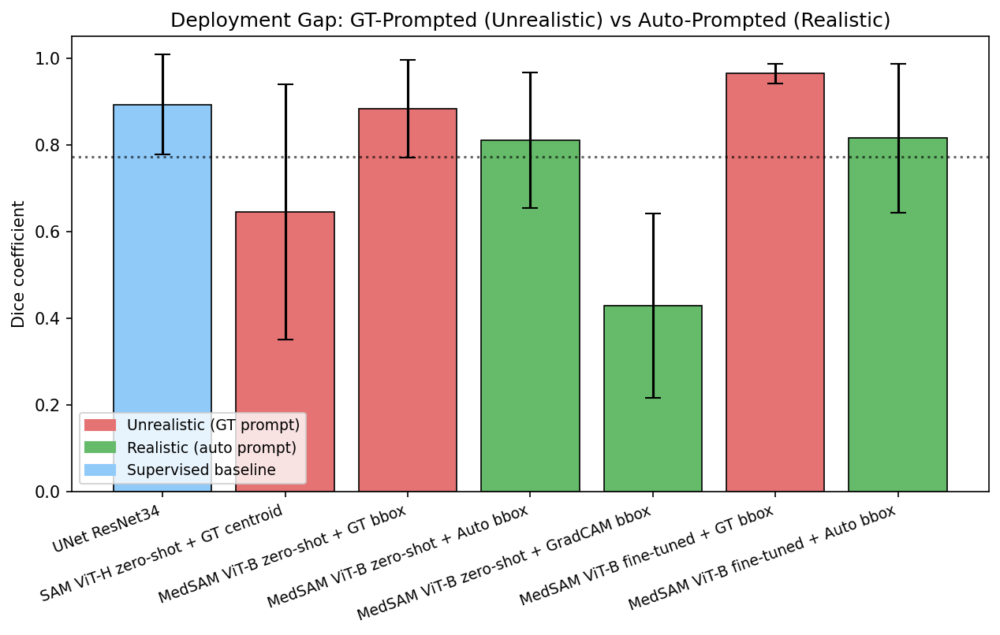
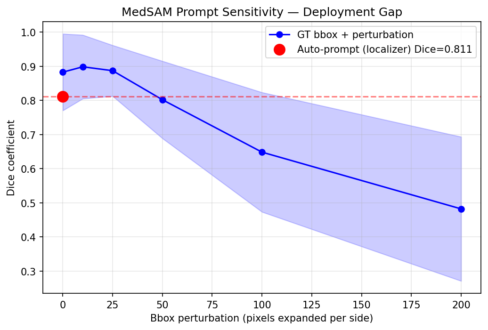
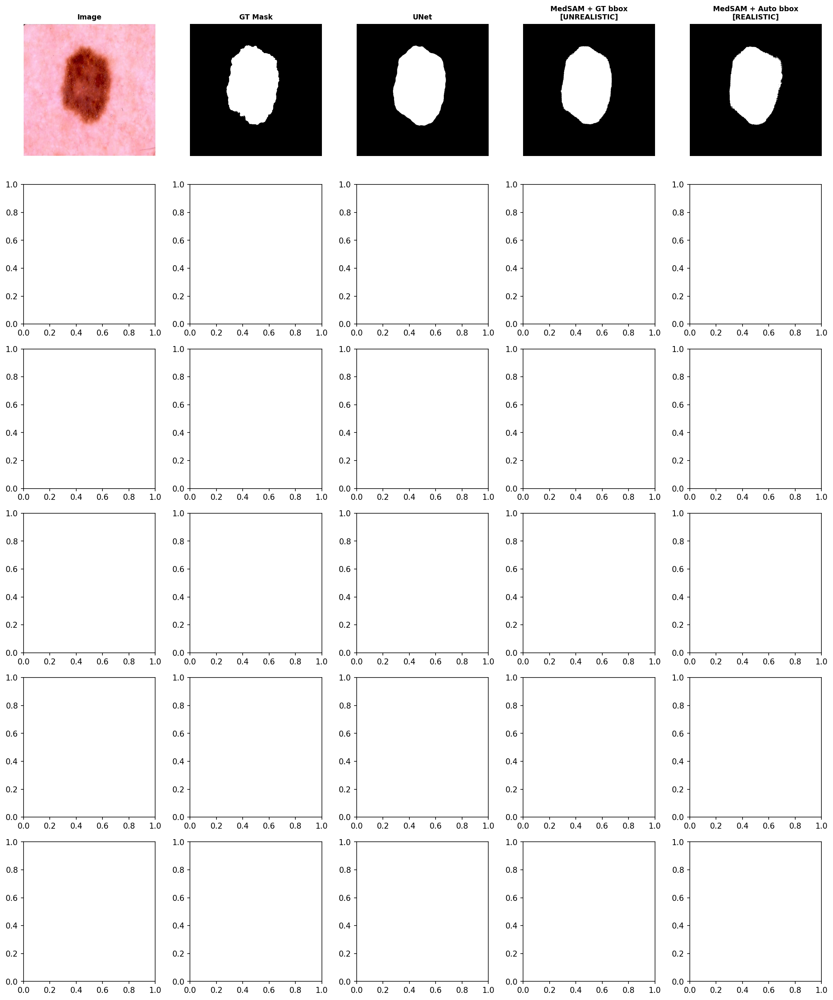

# DermSAM: Closing the Deployment Gap in Skin Lesion Segmentation

Benchmarking SAM and MedSAM on ISIC 2018 melanoma segmentation — with a focus on the **deployment gap**: published SAM papers measure performance using ground-truth-derived prompts that are unavailable in real clinical settings. This project quantifies that gap and introduces a fully automatic two-stage pipeline that closes it.

---

## The Problem

SAM achieves impressive segmentation when given a precise bounding box derived from the ground-truth mask. But in a real clinic, there is no ground truth. This creates an optimistic illusion — models look better on paper than they will ever perform in deployment.

**This project asks:** how much does performance drop when you remove the unrealistic prompt, and can a lightweight localizer recover it?

---

## Two-Stage Pipeline

```
Input image
    │
    ▼
EfficientNet-B0 Localizer  ──→  auto bounding box  (no GT used)
    │
    ▼
MedSAM ViT-B  ──→  segmentation mask
```

Stage 1 — a lesion localizer (EfficientNet-B0, bbox regression head) predicts a bounding box from the image alone. Stage 2 — MedSAM uses that box as its prompt. No clicks, no ground truth, no human in the loop.

---

## Results

| Approach | Dice | IoU | HD95 |
|---|---|---|---|
| UNet ResNet34 (supervised baseline) | 0.892 ± 0.115 | 0.821 ± 0.152 | 65.9 |
| SAM ViT-H zero-shot + GT centroid **[UNREALISTIC]** | 0.645 ± 0.227 | 0.538 ± 0.235 | 137.8 |
| MedSAM ViT-B zero-shot + GT bbox **[UNREALISTIC]** | 0.883 ± 0.112 | 0.804 ± 0.144 | 14.4 |
| MedSAM ViT-B zero-shot + Auto bbox **[REALISTIC]** | 0.811 ± 0.157 | 0.706 ± 0.188 | 35.0 |
| MedSAM ViT-B zero-shot + GradCAM bbox **[REALISTIC]** | 0.429 ± 0.218 | 0.297 ± 0.187 | 254.7 |
| MedSAM ViT-B fine-tuned + GT bbox **[UNREALISTIC]** | 0.964 ± 0.023 | 0.932 ± 0.041 | 0.8 |
| MedSAM ViT-B fine-tuned + Auto bbox **[REALISTIC]** | 0.815 ± 0.171 | 0.717 ± 0.207 | 34.8 |

> Published baseline to beat: ResUNet++ Dice 0.7726 (Jha et al. 2019)

The key comparisons:
- **Zero-shot deployment gap** (rows 3→4): GT bbox → auto bbox = −0.072 Dice
- **Fine-tuned deployment gap** (rows 6→7): GT bbox → auto bbox = −0.149 Dice
- **Fine-tuning benefit on realistic prompt** (rows 4→7): +0.004 Dice — the localizer quality is the bottleneck, not the segmentation model
- All realistic auto-prompt approaches beat the published ResUNet++ baseline (0.7726)


---

## Figures

**Deployment gap** — the visual argument:



**Prompt sensitivity curve** — Dice vs bbox perturbation magnitude, with the auto-prompt result as a red dot:



**Qualitative grid** — image | GT mask | UNet | MedSAM+GT | MedSAM+Auto:



---

## Repo Structure

```
dermSAM/
├── src/
│   ├── dataset.py              # ISICDataset, splits, augmentation
│   ├── models/
│   │   ├── unet_baseline.py    # UNet ResNet34
│   │   ├── localizer.py        # EfficientNet-B0 bbox regression
│   │   ├── sam_inference.py    # prompt strategies (GT / auto / GradCAM)
│   │   ├── medsam_finetune.py  # frozen encoder, trainable decoder
│   │   └── gradcam_prompt.py   # GradCAM → bbox
│   ├── train.py                # unified training entry point
│   ├── evaluate.py             # 7-row benchmark
│   ├── prompt_sensitivity.py   # degradation curve analysis
│   └── visualise.py            # portfolio figures
├── app/
│   └── demo.py                 # Gradio demo
├── notebooks/
│   ├── colab_train.ipynb       # Colab training workflow
│   └── results.ipynb           # portfolio narrative
├── data/splits/                # train/val/test CSVs (committed)
├── outputs/
│   ├── figures/                # all portfolio figures
│   └── metrics/                # benchmark and sensitivity CSVs
├── tests/                      # pytest suite (23 tests)
└── docs/
    ├── architecture.md
    └── results_log.md
```

---

## How to Run

```bash
conda activate melanoma-sam

# Train UNet baseline
python src/train.py --model unet --epochs 30 --lr 1e-4 --batch-size 16 --scheduler plateau --amp

# Train lesion localizer
python src/train.py --model localizer --epochs 20 --lr 1e-4 --batch-size 32 --scheduler plateau --amp

# Fine-tune MedSAM decoder
python src/train.py --model medsam --epochs 20 --lr 1e-4 --freeze-encoder --batch-size 4 --scheduler cosine --amp --grad-accum 4 --clip-grad 1.0

# Full 7-row benchmark
python src/evaluate.py --all --finetuned-medsam-ckpt checkpoints/last_medsam.pth

# Prompt sensitivity curve
python src/prompt_sensitivity.py --offsets 0 10 25 50 100 200

# Generate all figures
python src/visualise.py

# Run tests
pytest tests/ -v

# Launch Gradio demo
python app/demo.py
```

---

## Stack

Python 3.10 · PyTorch 2.x · segment-anything · segmentation-models-pytorch · timm · albumentations · Gradio · wandb · matplotlib

---

## References

- MedSAM: Ma et al. 2024, *Nature Communications*
- SAM: Kirillov et al. 2023, *ICCV*
- ISIC 2018 Task 1: Codella et al. 2018
- ResUNet++ baseline: Jha et al. 2019 — Dice 0.7726
